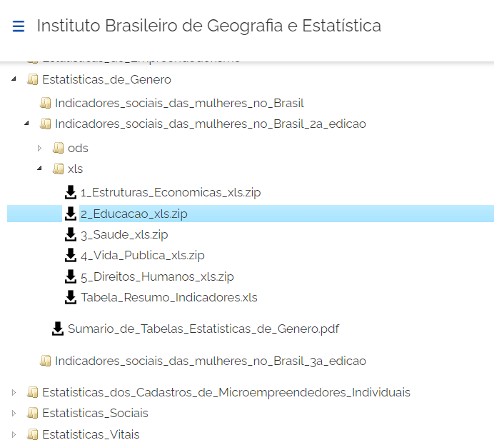

# TRABALHO DISCENTE EFETIVO REALIZADO NO 1º SEMESTRE DE 2023 NA UNIVERSIDADE CATÓLICA DE SANTOS
> FEITO POR:
> * DANIEL FERREIRA PINHEIRO DA SILVA
> * JOÃO VITOR PEREIRA RODRIGUES
> * KARINA CAMPOS LUIZ DA COSTA
> * VINÍCIUS HONORIO DE SOUZA

# TEMA: ANÁLISE DE DADOS DO IBGE
### O DATASET UTILIZADO FOI RETIRADO DE https://www.ibge.gov.br/estatisticas/downloads-estatisticas.html, ACESSADO EM MAIO DE 2023

#### LOCALIZACAÇÃO DO DATASET UTILIZADO DENTRO DO SITE DO IBGE
##### Estatisticas_de_Genero -> Indicadores_sociais_das_mulheres_no_Brasil_2a_edicao -> xls -> 2_Educacao_xls.zip
### DAS TABELAS PRESENTES NO DATASET, FOI UTILIZADA APENAS A TABELA 20. O ARQUIVO TAMBÉM FOI MODIFICADO PARA FACILITAR A MANIPULAÇÃO DOS DADOS
#### "Taxa de alfabetização de pessoas de 15 anos ou mais de idade, por sexo e cor ou raça, com indicação do coeficiente de variação, segundo grupos de idade e as Grandes Regiões - 2019"
### O PROGRAMA, FEITO EM C, FAZ A LEITURA DA BASE DE DADOS E PERMITE QUE O USUÁRIO FILTRE AS INFORMAÇÕES QUE DESEJA VISUALIZAR POR REGIAO OU POR GRUPOS DE IDADE, TAMBEM EXIBINDO A MAIOR E A MENOR TAXA DE ALFABETIZAÇÃO DE CADA REGIÃO
